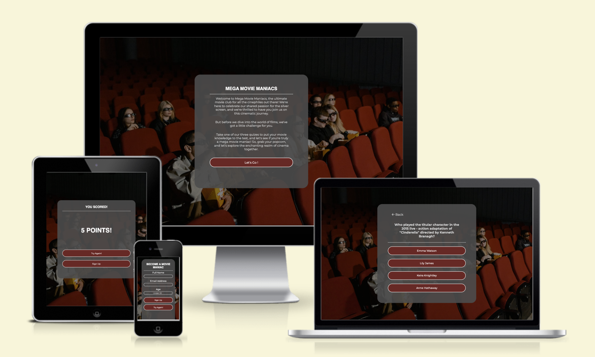
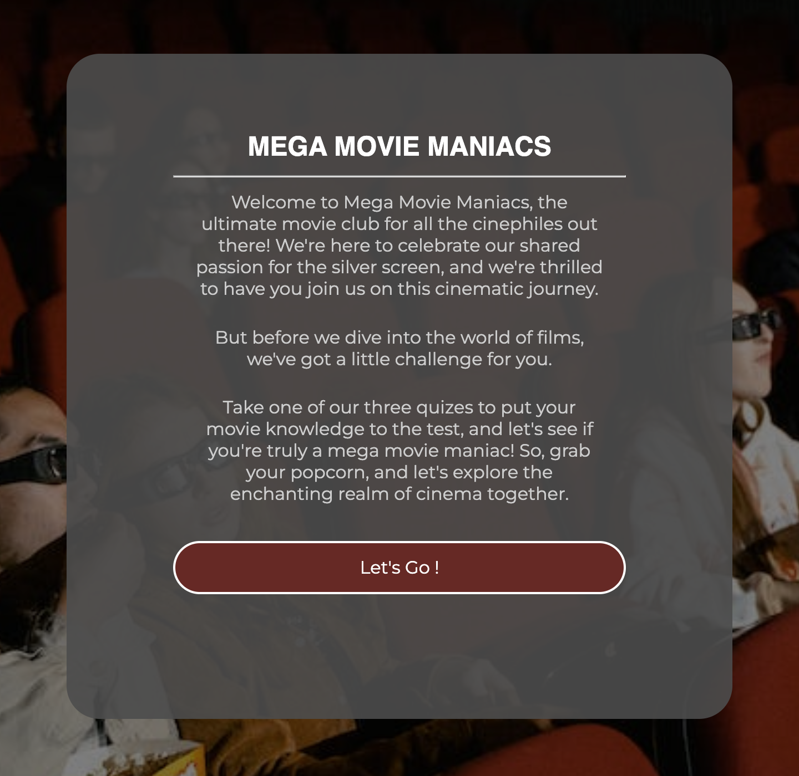
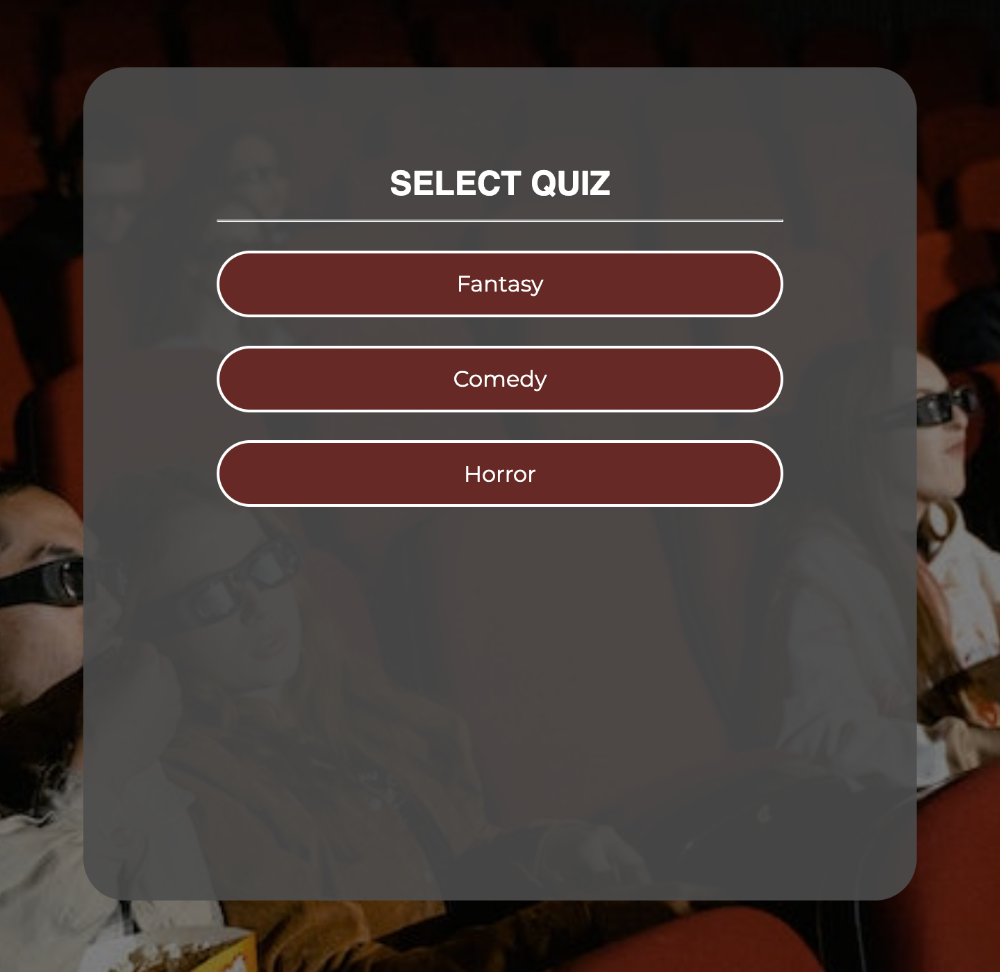
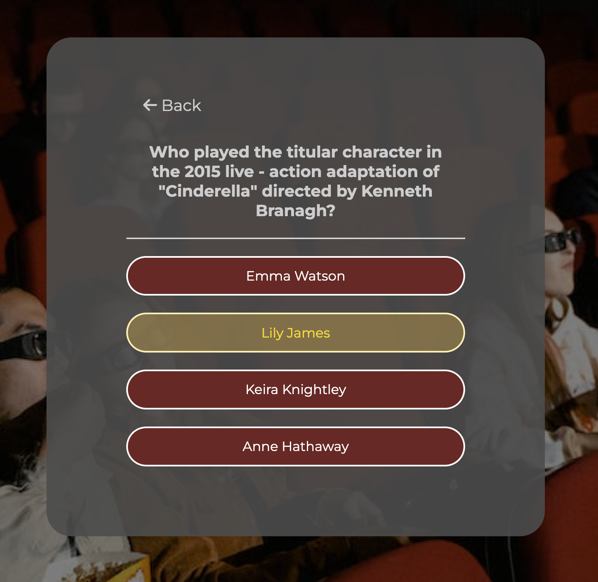
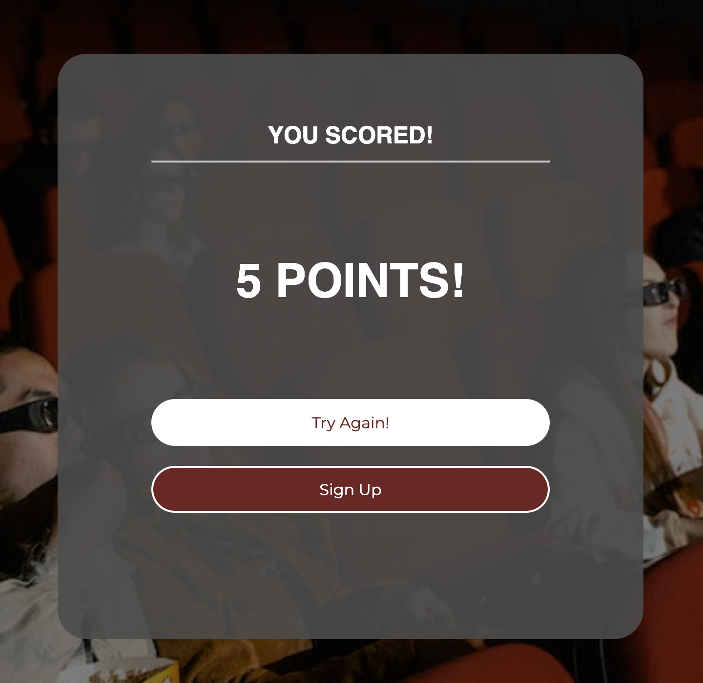
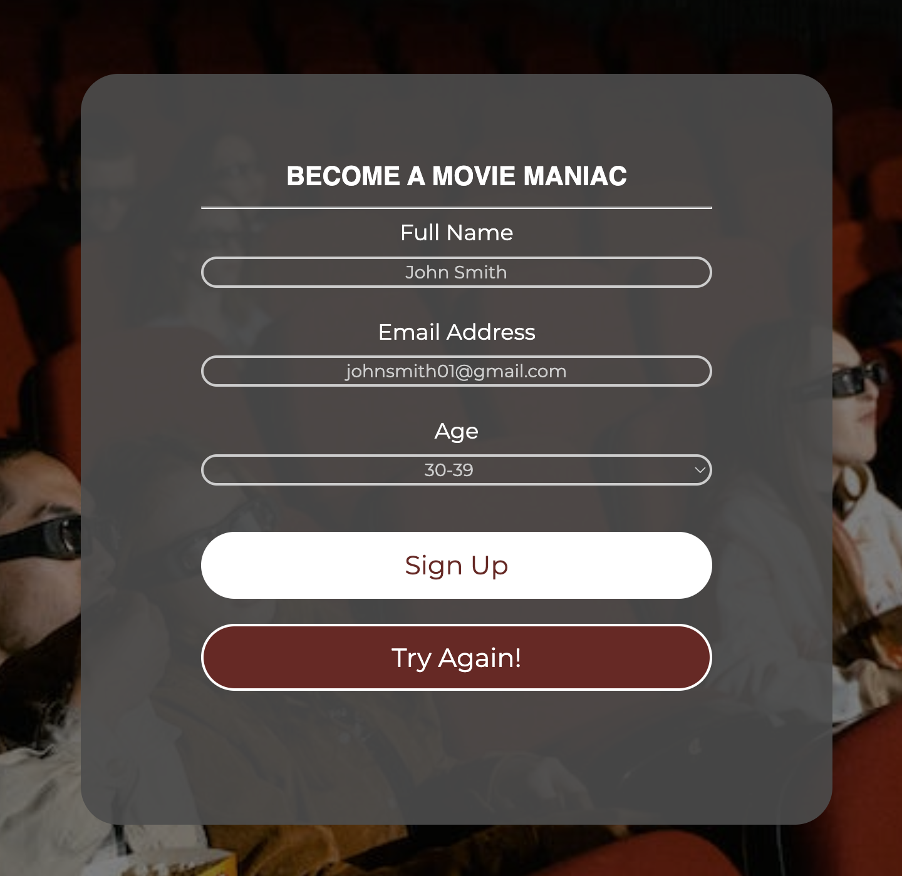
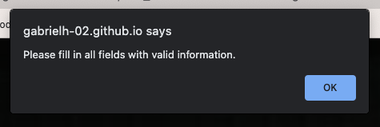
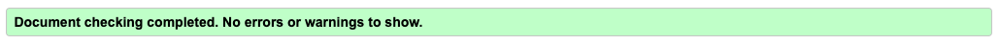
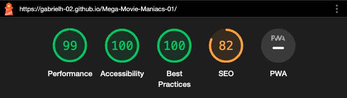

# Mega Movie Maniacs

Mega Movie Maniacs is a site that hopes to recruit members for its film club. Mega Movie Maniacs is a film club that watch films together, analyze films together and to broaden their own film library.  Essentially Mega Movie Maniacs is a book club, but instead of books it’s films and popcorn. The site provides a non-traditional look and format for a club, however this makes it stand out. Since most clubs have a site which is very much the about us section, what we do section and then a sign up section. However, Mega Movie Maniacs hopes to divert from this basic format by providing a hands on approach for attracting new members.

This is achieved by providing the user with the chance to take part in an interactive quiz. Through this quiz it hopes to attract members whilst also providing the user with information about the club and what the club is all about. To achieve this the quiz provides questions which generally a film fan would know. Whilst the site is primarily targeted towards young adults who are film fans and people that are generally interested in the art of cinema , the quiz broadens its audience by providing three different quizzes and all the questions span across different generations to appeal to a wide range of age groups.

The site remains on one page and has multiple features that run when called. The first being the welcome section, then a selection section, then followed by the quiz section and lastly a results section and then the possibility to run a signup section.  

## Features

### Existing Features

#### General Features

__The Body__

* The basic structure of the page is the background image of a cinema room and stated in the middle of the page is the main element that contains all the sections of code. The initial feature of the page is the welcome, which is beneficial for the user to fully navigate as soon as they land on the page. The style is kept consistent throughout the process of the quiz to keep organized format and keeps the attention on the quiz, and rather than changes to the page. The functionality of this as well keeps the quiz looking good when responsive as well. The whole site is fully responsive and works on all devices and certains stylistic choices have been made to ensure that the site works correctly.

__The Style__

* The style of the site is kept consistent throughout to provide a simplistic design for users to correctly navigate and identify each section. The colors of the site are primarily set by the background image of the cinema. Therefore the colors are set to the grayscale and dark red is the accent color, to match the classical cinema seats. This provides the user with a slick design and a color scheme that creates the feeling of a classical cinema. To add to the design the fonts ‘Bebas’ and ‘Montserrat’. These are standard fonts used to continue to provide a slick design and also for the user to correctly identify the text content. Since ‘Bebas’ is used to identify the title of the section such as “Select Quiz”, whilst ‘Montserrat’ is used for the text content of the buttons. This pairing of fonts is great since they have similar characteristics whilst providing  a different priority in context. An example of stylistic choice which was made was not having a next question button to submit the answer of the question each time. On phone for example there isn’t the problem of scrolling down and tapping the next question button You simply tap your selected answer and the next question appears. However, to amplify the same result on a larger device when the answer buttons are hovered over it glows gold this is provide the same expeicene to give the user the opportunity to see which answer they are selecting.

#### Welcome Area
* In this section are three major features, The first being the title, which clearly states the title of the site and provides the user with classification. The second feature is the written welcome statement which provides the user with a brief description and purpose of the site which draws their attention to the user. The language used is brief and simple for the user not to take much time on this section and encourages the user to start the quiz. Finally, the third feature is the ‘Let’s Go !’ button which when clicked on hides the welcome section and shows the selection Area. The button is colored differently to correctly identify its purpose. All buttons that trigger a different section, when on larger devices that use a mouse to naviagtet the page when hovered over, the color inverts to clearly display to the user it is interactive. 

#### Selection Area
* In this section there two different features, the first being the title to instruct the user what to do. The other is the buttons, each button runs a different set of questions. When clicked on the selected quiz, the selection area will disappear and display the question area with the prescribed questions.

#### Question Area
* The question area has three major features, the first being the back button which when clicked on the button refreshes the page which ultimately lands on the welcome section. The second feature is the question statement which displays the preset questions found in the JavaScript file. This is true for all quizzes and all questions. Then finally the third feature is the answer buttons which when one is clicked runs the next question and once five questions have been completed the question area disappears and the result area is displayed. Another function to the buttons is when the answer is answered correct it adds to the score found on the results page and if not it adds nothing. When displayed on larger devices that use a mouse to naviagtet the page when the answer buttons are hovered over, the color changes to gold highlighting to clearly tell the user that these features are interactive. 

#### Results Area
*This section contains four features, the first being the title which provides the user with the purpose of the section which is to show the users results. Second is the main feature of the section it will display the points gained. This is done by the use of functions to determine the amount a correct answers the user has selected. For each question comes one point therefore the maximum points is 5 and minimum is 0 points. This feature is largest of the section for it the main purpose of the section and it draws the users attention towards it. After this feature there are two buttons. The first button is the try again button when clicked it refreshes the page to land on the welcome section, this button is essential for it prompts the user to interact more with the page, they can either try another quiz or do the same one and try to improve on their score. This feature therefore amplfiles the use and interest of the film club thus boosting the likelihood of more membership. The finally the sign up button when clicked on the result section will disappear and show the sign up section of the page. Again prompting the user to sign up to film club.

#### Sign Up Area
*Lastly we have the sign up section for the convence for Mega Movie Mainacs it was beneficial to have this section for it is another interactive experience for the user and allows Mega Movie Maniacs the chance to contact and interact with their potential members. We have three major features within this section, the first being the title of ‘Becom a Movie Maniac’ a descriptive and fun title to provide the user with clarfffication of what this sections purpose is. Second is the form feature, with a name input which allows the site owner know how to address their potential member, the email address input which allows the site owner a way of creating contact with the applicant and finally the age input which is used for the site owner to get an understanding of what kind of generation is being targetted and who is interested. Yet these input fields help the site owner but they also provide the user with the ability to interact with the site owner creating that conection. Then the final feature of the page is the ‘try again’ button which runs the same function as the last ‘try again’ button. Having this button here allows the user to have access to the path to the start of the site. The finally there is the sign up button, in this section the button has different purpose, when clicked and the input fields have been fill in appropriately the button will log the values can create a personalise window alert which will inform the user that their submission was successful, with a statement which includes their input name value. This provides the user with clariffcation that their submission was successful therefore boosting the user experience. When the button is clicked on with no values or improper values in the input fields, a window alert will inform the user to correct or fill in the values correctly. This great way to ensure that values have been submitted and that these values are correct. On top of this the in future implementation these logged values could be committed to a data server, more on this in the future implementation section. 

### Features Left to Implement

These are a few ideas for future implementation:

* Add more quiz types to the selection area, to provide the user with more interactivity and the to broaden the scope of movie genres to appeal to more people that prefer other movie genres more than others.

*Extend and create more dynamic questions, keeping the same format of a multiple choice quiz but change the question up a bit. For example provide an image and the question could be ‘What film was this image taken from?’ or an audio question, ‘What film does this theme tone belong to?”. As well as this a way for the questions to change order and for the answers to change order to, to keep the user interest and not keep the same question after question. This would add more of a dynamic experience for the user. Another addition to the quiz area would be the possibility to see what question is on, by displaying a tally in the top right corner of the question section. 
*Another feature that would enhance the experience of the quiz would be to change the color scheme and background image to of the page when a particular quiz type is clicked. For example if horror was selected it could become a darker color scheme and creepy background image. This again would boost the users experience to be more dynamic.

*Lastly would be the sign up section, with future the implementation the data from the form could be submitted to data server. This would open to new possibaliies for the site because it could change it’s purpose. For example if data was submitted to a server the user could use their email address to log into the site which would allow them to play the quizzes and log their scores for that quiz and try beat their score and more. This again would be boost the chances of membership and create a recurring activity on the site for film fans to dive into quizzes.

## Languages and Resources

* [HTML5](https://html.spec.whatwg.org/multipage/)  -Markup language which makes up the content of the site.
* [CSS3](https://www.w3.org/TR/css-2022/)   -Used to style the whole site.
* [JavaScript](https://www.w3.org/TR/css-2022/)   -Used to style the whole site.
* [FontAwesome](https://fontawesome.com/)   -Linked for all icons used on the site
* [Google Fonts](https://fonts.google.com/) -Source of the site’s fonts.
* [Favicon Generator](https://realfavicongenerator.net/) -Used to generate favicon files.
* [GitHub](https://github.com/) -Repository for the site’s code.
* [Codeanywhere](https://www.codecademy.com/)   -IDE used to write the site.
* [HTML Validator](https://validator.w3.org/)   -Used to check and validate the HTML code used in the site.
* [CSS Validator](https://jigsaw.w3.org/css-validator/) -Used to check and validate the CSS code used in the site.
* [JavaScript Validator](https://jshint.com//)   -Used to check and validate the JavaScript code used in the site.

## Testing

* I have tested the site on multiple browsers, such as; Chrome, Safari and Firebox.
* The site is responsive to all devices and has a clear and organized format. I have tested this by using dev tools on Chrome as well as sharing the link to the site on my other devices. The site also has been tested and its structure also adapts to the screen size.
* All the information on the site is clear and visible and the contrast of color is well set and is readable and easy to understand. I have also shared the site with other people to have an understanding of their views on the site and they all came to the same result that the site is easy to read and understand.
* I have made sure that functions for refreshing and navigating to other sections of the quiz work appropriately.
* I have made sure that all three quizzes work appropriately and run when called. As well as that the score is displayed based on the correct values that have been selected by correctly getting the right answers as well as intentionally selecting the wrong answers to see that no points were added to the score. 
* Finally, I have made sure that the form inputs are required and only the appropriate value for the form to be submitted. As well as this I have confirmed that the values inserted into the inputs have been successfully logged to the console.

### Validator Testing

HTML: 

* There were errors, however, they have since been checked and adjusted (Please see fixed bugs). However, now there are no errors on the when passing through the official [W3C validator](https://validator.w3.org/nu/?doc=https%3A%2F%2Fgabrielh-02.github.io%2FMega-Movie-Maniacs-01%2F)

CSS:

* There were no errors on the site when passing through the official [(Jigsaw) validator](https://jigsaw.w3.org/css-validator/validator?uri=https%3A%2F%2Fgabrielh-02.github.io%2FMega-Movie-Maniacs-01%2F&profile=css3svg&usermedium=all&warning=1&vextwarning=&lang=en)

JavaScript: file 1 & 2:

* There were no errors, however, they were a several missing semicolons which have been addressed. [Jshint](https://jshint.com/)

### Accessibility 
* The site has been through the developer tool Lighthouse on Chrome, the accessibility score comes to 100%. 

### Bugs

#### Fixed Bugs

HTML: 

* There was a warning on behalf of the Quiz Area. Since the content of the question is inserted with the use of JavaScript functions, I left the values for the answer buttons as well as the question statement section. For this the validator suggested it would be best to have a value in the header of the section, therefore I insert the value zero into the question statement. Knowing that this would not change the outcome due to the fact that the JavaScript functions replace such value.

* Two other errors were due to the form element in sign up section of the quiz. This was due to the fact that by default each form element has an action attribute. Since the form information is never sent anywhere such as landing page, it was best to remove the attribute for the time being. As well as this the required attribute attached to the age selection on form was creating an error, therefore I removed this as well knowing that functions set in the JavaScript file already make it a requirement to submit the data in the input fields.

CSS:

* No errors were found therefore nothing was changed.

JavaScript: file 1 & 2:

* In the two JavaScript files there were warnings of the use of ‘const’ and ‘let’ due to the functionality of versions of JavaScript. However, more important error were addressed such as missing semi-colons. Other than that there were no other errors found.

#### Unfixed Bugs
* There are no unfixed bugs, the only concern is that on the sign-up section, the values for the user is logged to console, however these values are never logged to a data server, but as mention in future implementation of the project this could change.

## Deployment
The site was deployed to GitHub pages. The steps to deploy are as follows:
* In the GitHub repository, navigate to the Settings tab
* From the source section drop-down menu, select the Main Branch, then click “Save”.
* The page will be automatically refreshed with a detailed ribbon display to indicate the successful deployment.

The live link can be found [here!](https://gabrielh-02.github.io/Mega-Movie-Maniacs-01/)

## Credits

### Content
* The code template for the site was provided by [Code Institute](https://github.com/Code-Institute-Org/ci-full-template)
* All questions and answers were inspired by goggle searches of quiz questions in different categories such as fantasy, comedy, and horror. As well as my own knowledge in films and series. 
* Inspiration for the look of the quiz was based off  [Astronomy Quiz](https://miker94.github.io/CI-Project-Portfolio-2/)
* The project Love Maths was huge help to understanding the use of fucnitons.
* My former project [Harmony Haven Hotels](https://gabrielh-02.github.io/Harmony-Haven-Hotels/) helped develop basic css and the form section of this code was reused and modified from this project.
* The youtube channel [Web Dev Simplified](https://www.youtube.com/@WebDevSimplified/videos) was helpful to understand the complex of functions. Such the function to refresh the web page.
* All fonts for the page were sampled from the [Google Fonts](https://fonts.google.com/)
* All icons found on the page were taken from [Font Awesome](https://fontawesome.com/)

### Media
* All photos that are used in the site were taken from [pexels](https://www.pexels.com/)
* The favicon was generated by me through the use of Adobe Illustrator.
* The favicon files for different devices were developed by [Favicon Generator](https://realfavicongenerator.net/).

